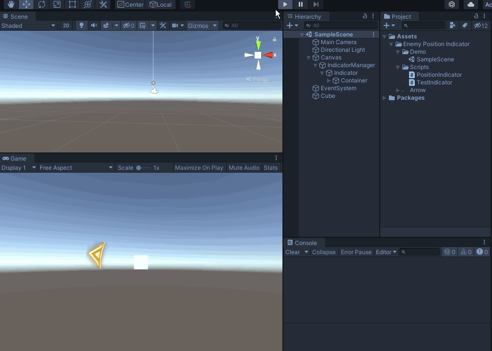

# Enemy Positon Indicator

这是一个简单的 敌人位置指示器,仅供参考~

This is a very simple repo which would teach you how to make a Enemy Position Indicator，as  animated .GIF File below.

> 开发环境：

* .Net 4.x

* Unity 2019.4.28cf1

> 动画演示

* 初始版本仅支持 ``Canvas.Render Mode = Screen Space - Overlay `` 的模式

  The first version can only support ：``Canvas.Render Mode = Screen Space - Overlay `` 

* 如何测试？ 答：Scene场景拖拽小方块即可，超出相机视野就显示指示器。

  How to test, as you see,just drag the small cube on Scene view , The indicator is displayed when cube out of camera's field of view.
